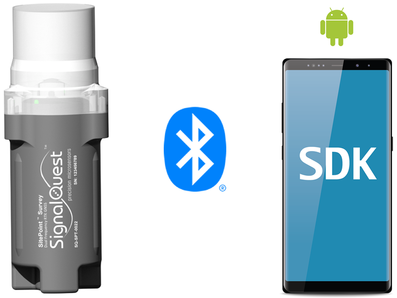

# SitePoint Android Example App Documentation

SignalQuest provides an Android SDK and implementation example app for interfacing with SignalQuest's GNSS devices.

## Overview

SignalQuest's SitePoint GNSS devices offer centimeter-level accuracy in a convenient, lightweight form factor.

The Android SDK allows developers to build custom Android apps that integrate with these devices.

An example implementation is shown in the provided example app, showing the necessary steps to interface with the devices through the Android SDK.

See the [Implementation Guide](Implementation_Guide/B1_Implementation_Guide.md) for a walkthrough of the example app's SDK implementation.

## Topics

### Getting Started

- [SitePoint SDK](Getting_Started/A1_SitePoint_SDK.md)
- [SitePoint Android Example App](Getting_Started/A2_Android_Java_Example_App.md)
- [SitePoint Datasheet](Getting_Started/A3_SitePoint_Datasheet.md)
- [SQ Survey Mobile App](Getting_Started/A4_SQ_Survey_Mobile_App.md)

### Implementation

- [Implementation Guide](Implementation_Guide/B1_Implementation_Guide.md)
- [Permissions](Implementation_Guide/B2_Permissions.md)
- [Bluetooth Setup](Implementation_Guide/B3_Bluetooth_Setup.md)
- [Message Handling](Implementation_Guide/B4_Message_Handling.md)
- [NTRIP](Implementation_Guide/B5_NTRIP)
